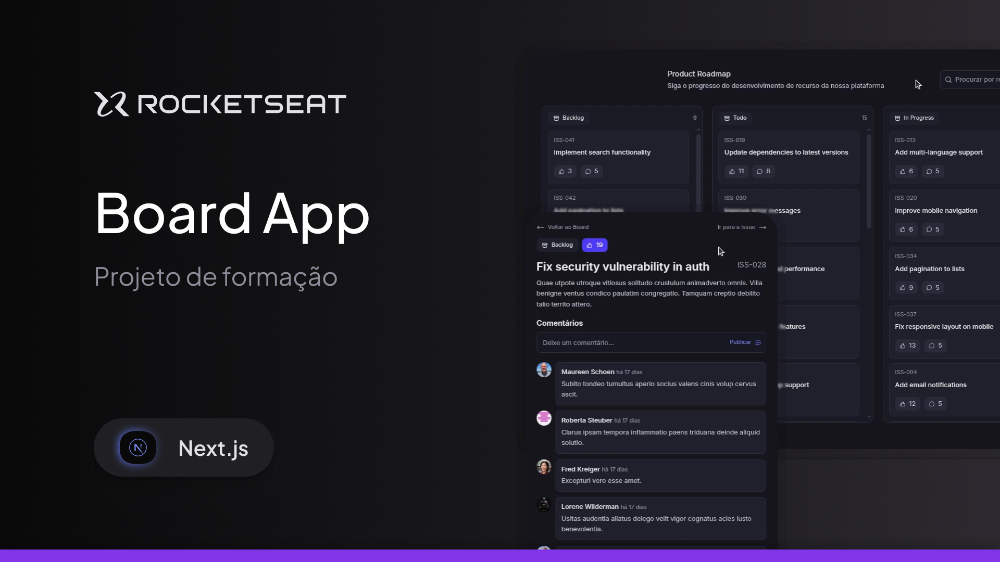
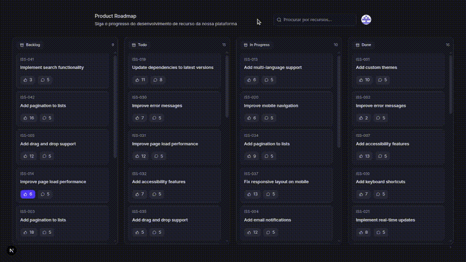

<h1 align="center">Board App</h1>



> Um aplicativo de roadmap que permite buscar issues facilmente e interagir curtindo e comentando após autenticação com o GitHub.



## 🛠️ Tecnologias e Ferramentas

### Core & Frameworks
- [Next.js 16](https://nextjs.org) - Framework React para o front-end e rotas
- [React 19](https://react.dev) - Biblioteca para construção de interfaces
- [TypeScript](https://www.typescriptlang.org) - Tipagem estática para JavaScript
- [Tailwind CSS v4](https://tailwindcss.com) - Estilização baseada em utilitários

### Back-end, Autenticação & API
- [Hono](https://hono.dev) - Framework web leve para construção das APIs
- [Better Auth](https://www.better-auth.com) - Autenticação (login com GitHub)
- [Zod](https://zod.dev) - Validação de schemas e dados de entrada

### Banco de Dados
- [PostgreSQL](https://www.postgresql.org) - Banco de dados relacional (via Docker)
- [Drizzle ORM](https://orm.drizzle.team) - ORM e gerenciamento de migrações (`drizzle-kit`)

### Gerenciamento de Estado & UI
- [TanStack Query (React Query)](https://tanstack.com/query) - Gerenciamento e cache de dados assíncronos
- [Nuqs](https://nuqs.47ng.com) - Gerenciamento de estado de pesquisa via URL (Search Params)
- [Lucide React](https://lucide.dev) - Biblioteca de ícones

### Ferramentas de Desenvolvimento
- [Biome](https://biomejs.dev) - Linter e formatador de código
- [Faker.js](https://fakerjs.dev) - Geração de dados fictícios para o script de seed

## 🚀 Como Executar o Projeto

### Pré-requisitos

Antes de começar, certifique-se de ter instalado em sua máquina:
* [Node.js](https://nodejs.org/)
* [PNPM](https://pnpm.io/)
* [Docker](https://www.docker.com/)

### Passo a Passo

1. **Clone o repositório:**
  ```bash
    git clone [https://github.com/BrunoBecoski/board-app.git](https://github.com/BrunoBecoski/board-app.git)
    cd board-app
  ```

2.  **Instale as dependências:**
  ```bash
    pnpm install
  ```

3.  **Inicie o banco de dados PostgreSQL:**
  ```bash
    docker compose up -d
  ```

4.  **Execute as migrações e a seed:**
```bash
  pnpm run db:migrate

  pnpm run db:seed
```

5.  **Inicie o servidor de desenvolvimento:**
  ```bash
    pnpm dev
  ```

Acesse http://localhost:3000 no seu navegador para ver a aplicação rodando.
